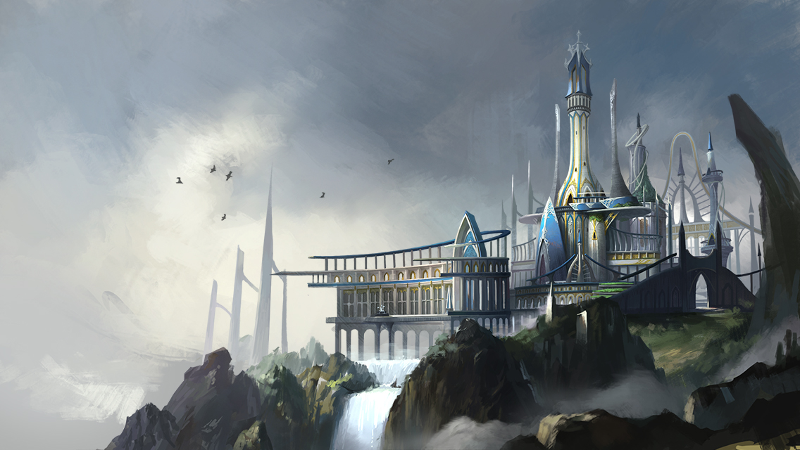

# 🏰 MagicTower | 魔塔

> 🇨🇳 **中文说明**  |  🇺🇸 **English Version below**

---

## 📖 简介 | Introduction

基于 Cocos2d-x 3.17.2 引擎开发的魔塔类游戏，包含回合制战斗系统、角色成长、宠物系统、多关卡怪物挑战等功能。

A Magic Tower style game built with Cocos2d-x 3.17.2, featuring turn-based combat, character progression, pet system, and multi-level monster challenges.

---

## 🎮 游戏截图 | Screenshots

<p align="center">
  
  
</p>

---

## 📦 下载 | Download

👉 **安装包请前往 [Releases](../../releases) 页面下载**

👉 **Download the installer from the [Releases](../../releases) page**

---

## 🚀 运行方法 | How to Run

1. ▶️ 双击运行 `luaTest.exe` 即可启动游戏
2. 🎯 在登录界面等待动画播放后自动进入主场景
3. ⚔️ 角色将自动与怪物进行回合制战斗

1. ▶️ Double-click `luaTest.exe` to launch the game
2. 🎯 Wait for the login animation to auto-enter the main scene
3. ⚔️ The hero will automatically engage in turn-based combat with monsters

```
# 目录结构 / Directory Structure
# ├── src/
# │   ├── app/
# │   │   ├── views/        ← 场景和视图 / Scenes & Views
# │   │   ├── base/         ← 战斗、对象管理 / Battle & Object management
# │   │   └── myGameInit.lua ← 游戏初始化 / Game initialization
# │   ├── framework/        ← Quick-Cocos2d-x 框架 / Framework
# │   └── packages/mvc/     ← MVC 架构 / MVC architecture
# ├── res/
# │   ├── csb/             ← UI 布局文件 / UI layout files
# │   └── image/           ← 图片资源 / Image assets
# └── luaTest.exe
```

---

## ℹ️ 版本信息 | Version Info

| **项目** / **Item** | **内容** / **Content** |
|---|---|
| **Engine** | `cocos2d-x-3.17.2` |
| **Platform** | Windows 32-bit (Win32) |
| **Language** | Lua |
| **Status** | 魔塔游戏开发中 / Magic Tower game in development |

---

## 💡 备注 | Notes

- 回合制战斗系统，角色自动行走与怪物交战
- 宠物系统，角色可携带宠物参战
- 多关卡怪物挑战，逐步增强难度
- 登录场景动画，龙飞行动画 + 进度条
- UI 系统：签到、背包、邮件、任务、活动弹窗

- Turn-based combat system with auto-walk and monster engagement
- Pet system — heroes can bring pets into battle
- Multi-level monster challenges with progressive difficulty
- Login scene animation with dragon flight + progress bar
- UI system: sign-in, backpack, mail, mission, and activity pop-ups